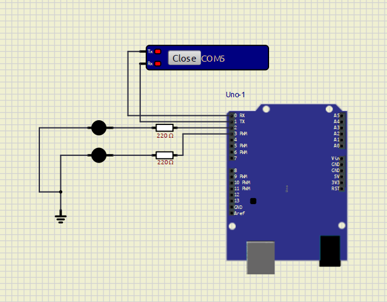

# Sistema de Detecção de Quedas com Arduino e MediaPipe - 2025



## Integrantes do Grupo 

- Felipe de Campos Mello Arnus - RM550923
- Gabriel Machado Carrara Pimentel - RM99880
- Leticia Cristina Gandarez Resina - RM98069
- Vitor Hugo Gonçalves Rodrigues - RM97758

## 📌 Aplicabilidade

Este projeto tem como objetivo detectar quedas de pessoas utilizando visão computacional (MediaPipe) e acionar um sinal no **Arduino Uno** via porta serial sempre que uma queda for identificada. É ideal para sistemas de segurança em residências de idosos ou clínicas, podendo ser integrado com alarmes, notificações ou dispositivos de emergência.

---

## ⚙️ Componentes Utilizados

- Arduino Uno
- 2 LEDs
- 2 resistores de 220 ohms
- Protoboard ou simulador (ex: SimulIDE)
- Cabos de conexão
- Comunicação serial via `COM` (ex: COM5)
- Software: Python com OpenCV, MediaPipe e pySerial

---

## 🔌 Montagem do Circuito

1. **LEDs**:
   - Cada LED está conectado ao Arduino com um resistor de 220Ω.
   - Um dos LEDs pode representar "OK" (sem queda).
   - Outro LED pode representar "ALERTA" (queda detectada).

2. **Pinos utilizados**:
   - Os LEDs estão conectados a dois pinos digitais do Arduino (ex: pinos 2 e 3).
   - O GND do Arduino está ligado ao terra comum dos LEDs.
   - Comunicação serial simulada está conectada ao RX e TX do Arduino.

3. **Simulador**:
   - O circuito pode ser montado no **SimulIDE** com a porta serial configurada corretamente (COM5).
   - No Python, o código deve abrir essa mesma porta com: `serial.Serial('COM6', 9600)`

---

## 💻 Funcionamento

1. O Python usa a biblioteca **MediaPipe** para detectar o corpo humano e analisar se a pessoa caiu (analisando pontos como nariz, quadril e joelhos).
2. instalar `pip install matplotlib opencv-python notebook pyserial mediapipe`
3. Ao detectar uma **queda**, o Python envia a mensagem `queda` pela serial.
4. Ao detectar que está tudo certo novamente, envia `ok`.
5. O Arduino pode acender os LEDs correspondentes ao status recebido:
   - `queda`: acende LED vermelho
   - `ok`: acende LED verde

---

## ▶️ Execução

1. Execute o código Python `detector_de_quedas.py`.
2. Certifique-se de que o Arduino (físico ou simulado) esteja com o firmware correto lendo mensagens via serial.
3. O sistema processará um vídeo (ou webcam) e atualizará o estado em tempo real.

---

## 📦 Exemplo de Integração Serial (Arduino) - quedas.ino

```cpp
#define LED_VERDE 2
#define LED_VERMELHO 3

String comando = "";

void setup() {
  Serial.begin(9600);
  pinMode(LED_VERDE, OUTPUT);
  pinMode(LED_VERMELHO, OUTPUT);
  digitalWrite(LED_VERDE, HIGH);
  digitalWrite(LED_VERMELHO, LOW);
}

void loop() {
  while (Serial.available()) {
    char c = Serial.read();
    if (c == '\n') {
      comando.trim();
      if (comando == "queda") {
        digitalWrite(LED_VERDE, LOW);
        digitalWrite(LED_VERMELHO, HIGH);
      } else if (comando == "ok") {
        digitalWrite(LED_VERDE, HIGH);
        digitalWrite(LED_VERMELHO, LOW);
      }
      comando = "";
    } else {
      comando += c;
    }
  }
}
```
# Usando o SimulIDE
Após montado o circuito pela IDE, vá para o código ino e compile o arquivo.
Depois de compilado, ir em **sketch** e exportar o código para binário
No SimulIde carregue o firmware que exportamos do arquivo .hex

## Por fim rode os dois programas e veja o sistema funcionar após a queda aparente no video
